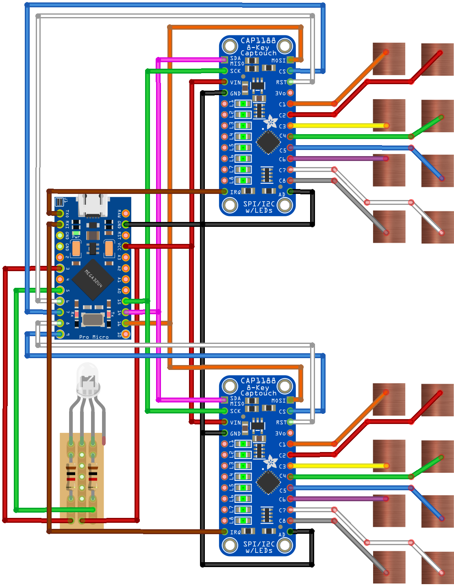
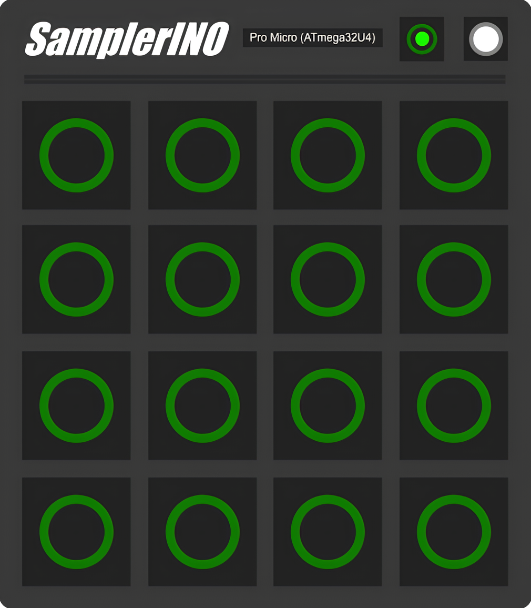

# SamplerINO 🎛️

## Table of Contents

- [Description](#description)
    - [Project](#project)
    - [Repository](#repository)
    - [Technical Details](#technical-details)
- [Gallery](#gallery)
    - [Circuit Diagram](#circuit-diagram)
    - [3D Models](#3d-models)
    - [Controller Device](#controller-device)
    - [User Interface](#user-interface)
- [License](#license)

## Description

### Project
**SamplerINO** utilizes an *ATmega32U4* microcontroller and two *CAP1188* 8-channel capacitive touch sensor modules to assemble a USB MIDI controller featuring 16 touch-sensitive pads. The prototype circuit board is housed inside a custom-designed 3D printed enclosure, which facilitates the installation of the pads, as well as an LED indicator and a power switch. You can watch a video demonstration of this hardware MIDI controller and its dedicated software sampler at the following [link](https://www.youtube.com).

### Repository
The code in this repository is organized into several directories, with the source (`.cpp`) files, header (`.h`) files, and external libraries of the controller located in the [*src*](src), [*include*](include), and [*lib*](lib) directories, respectively. The *Max* patch implementing the user interface of the accompanying sampler, along with a collection of drum samples gathered from various royalty-free web sources, are contained in the [*max*](max) directory. Lastly, all hardware-related files (i.e. the circuit diagram and the 3D model designs) are located in the [*hw*](hw) directory, while the [*img*](img) directory contains all images displayed in the present documentation.

### Technical Details
This project was developed using `Max 8.1.11` and *Visual Studio Code* on `Windows 10`, with the *PlatformIO* extension employed to upload the code to the *ATmega32U4* microcontroller embedded in an *Arduino*-compatible *Pro Micro* board. The controller pads were made by cutting 4×4cm pieces from a 0.5mm thick copper sheet, while the enclosure screw holes were designed for M2 threaded heat inserts. Lastly, a common anode RGB LED was used for the LED indicator.

## Gallery

### Circuit Diagram

### 3D Models
")
")
")

### Controller Device

### User Interface

## License

*SamplerINO* © *2024* by *Alexandros Iliadis* is licensed under the [GNU General Public License v3.0](https://choosealicense.com/licenses/gpl-3.0/).

Permissions of this strong copyleft license are conditioned on making available complete source code of licensed works and modifications, which include larger works using a licensed work, under the same license. Copyright and license notices must be preserved. Contributors provide an express grant of patent rights.

See the [`LICENSE.md`](LICENSE.md) file for more details.